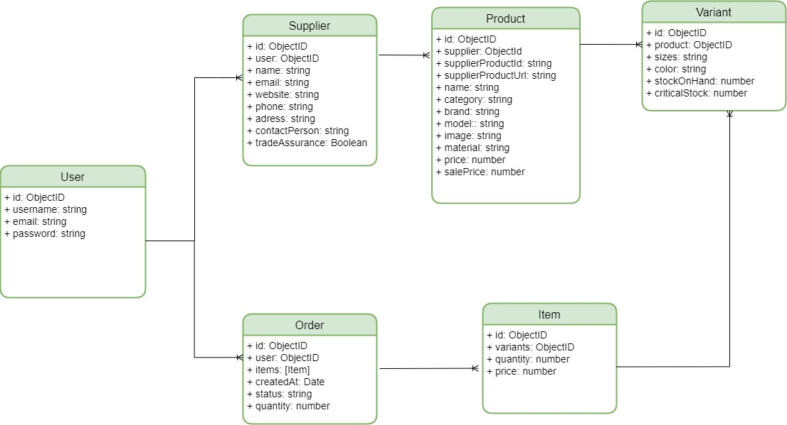

# Project

## Introduction

X es un programa de gestión de compras a proveedores.

A través de esta App los usuarios podrán tener un registro de todos los productos y sus variantes clasificados por proveedores, facilitándoles el control y la gestión de su inventario, y alertándoles cuando el stock sea crítico.

Además, permite elaborar órdenes de compra y consultar el historial de órdenes de compra ya existentes, de esta forma  la App puede ayudar al usuario a gestionar el control financiero de los pagos recurrentes a proveedores.

Con la información registrada en la App, el usuario puede solicitar informes/analíticas que muestren su situación financiera, su período medio de pago (PMP),  la variación de los precios,  etc. —>VERSIÓN 2

## Functional Description

### Use Cases

### Activities

#### Add product

#### Create order

#### Update order's status

### Wireframes / UI Design 

## Technical Description

### Blocks

### Data Model (ER)

### Code Coverage

### Technologies