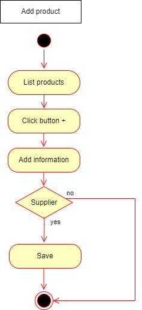
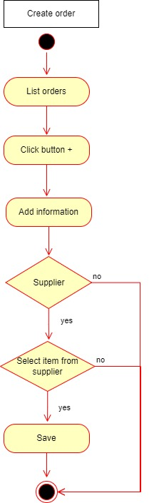
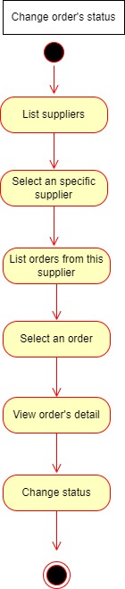
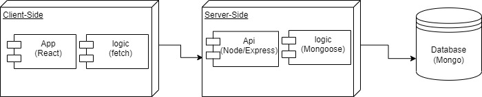

# Cargo

## Introduction

Cargo is a supplier purchase management programme.

Through this App, users will be able to have a record of all products and their variants classified by suppliers, allowing them to control and manage their stock.

In addition, it allows you to create purchase orders and consult the history of purchase orders.

## Functional Description

### Use Cases

### Wireframes

### Activities

#### Add product

#### Create order

#### Update order's status

### Wireframes / UI Design 

## Technical Description

### Blocks

### Data Model (ER)

### Technologies
> ## React 
> ## Node 
> ## Express 
> ## JWT 
> ## Mongoose 
> ## Mongo 
> ## Chartjs 

## TO-DO LIST
- User settings
- Contact with suppliers
- Filter orders by date
- Monthly best selling products