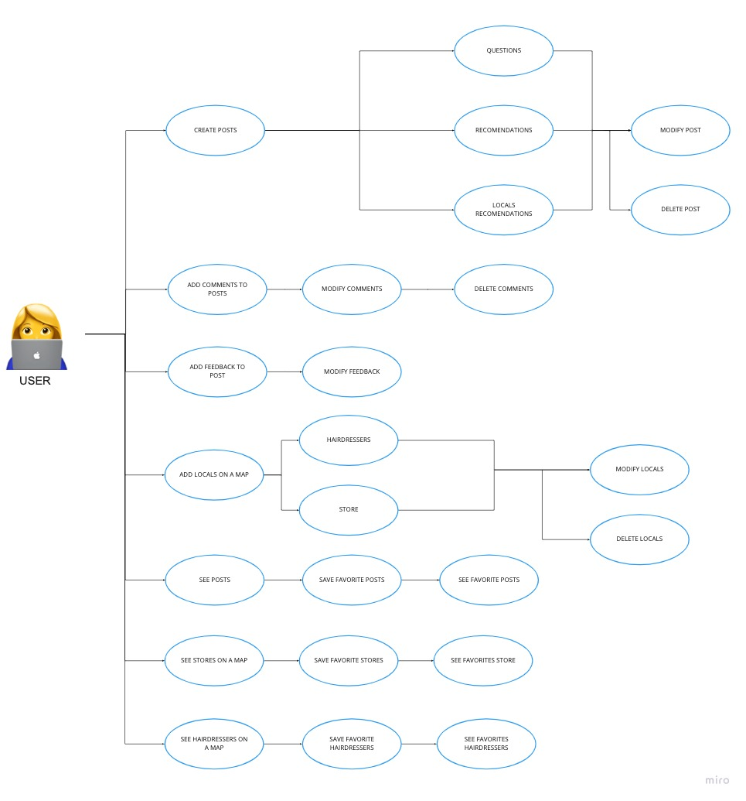
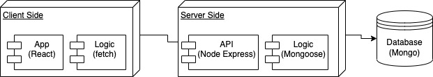
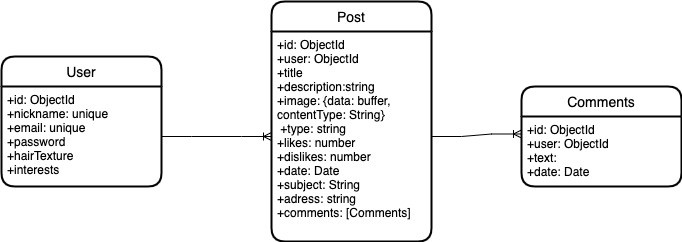

# RockUrAfro

## Introduction
Por que?
Desde mi experiencia y la de muchas de las mujeres de mi familia y amigas, de pelo afro, el encontrar la peluquería de 'confianza'  o el producto idóneo para aplicar en nuestro pelo siempre es una tarea compleja; lena muchas veces de infinitas pruebas/error que hacen el proceso agotador.
Por tanto, surge la idea, de hacer una web que permita unir a todas las primas todas las amigas y todos aquellos que quieran "rock their afro", puedan compartir su conocimiento y recomendaciones.

## Functional Description
Como funcionará?
-Demo#1 (solo usuarios, no negocios)
Para usar la web deberás estar registrado. Al inicio se tendrá la opción de hacr un test que permitirá una mejor experiencia de usario.
Como usuario podrás hacer preguntas generales y responder a preguntas de otros usuarios, subir fotos recomendando productos así como ubicación de locales para comprar productos as como peluquerías.
-Demo#2 (usuarios y negocios)
Los negocios podrán promocionarse y responder a preguntas de los usuarios.

### Use Cases

### Activities

### Wireframes / UI Design

### Tecnical Description

### Blocks

### Data Model (ER)
add a photo to user

### Code Coverage

### Technologies
- React 
- Node 
- Express 
- JWT 
- Mongoose 
- Mongo 

### TODO list
- Add locals as Users
- Add map
- Add general chat
- Add tests
- Improve the code (components structure)
- Documentar
