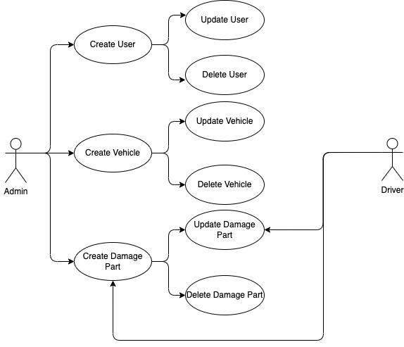
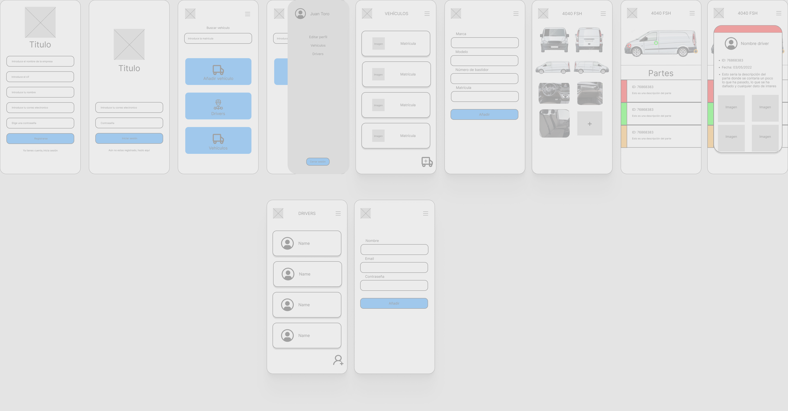
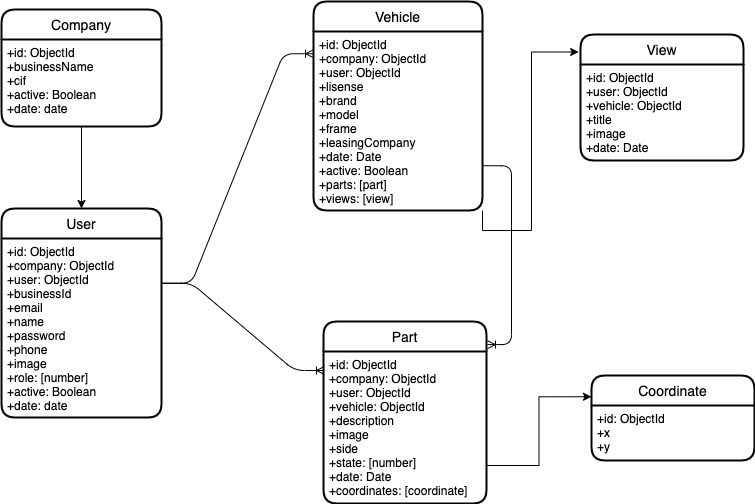

# Dafloat

## Introducción
---
App para la gestión de daños de vehículos dirigido a empresas en las que tienen una flota. Podrás ver de un solo vistado todos los partes abiertos que tiene cada vehículo pudiendo añadir todos los que necesites señalando el punto exacto. Conseguimos ordenar el control de la flota, agilizar la revisión diaria de los vehículos y facilitar el reporte de daños desde el propio driver.

## Descripción funcional
---
### Casos de uso

### Diseño

## Descripción técnica
---

### Modelos de datos

### Bloques

### Tecnologías

- React

- Node

- Express

- Mongoose

- Mongo

### TO-DO

- Añadir funcionalidad para activar y desactivar los vehículos

- Añadir funcionalidad para activar y desactivar los usuarios

- Generar contraseña para usuario automáticamente

- Añadir test

- Documentar las lógicas

