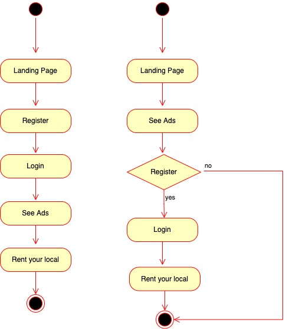
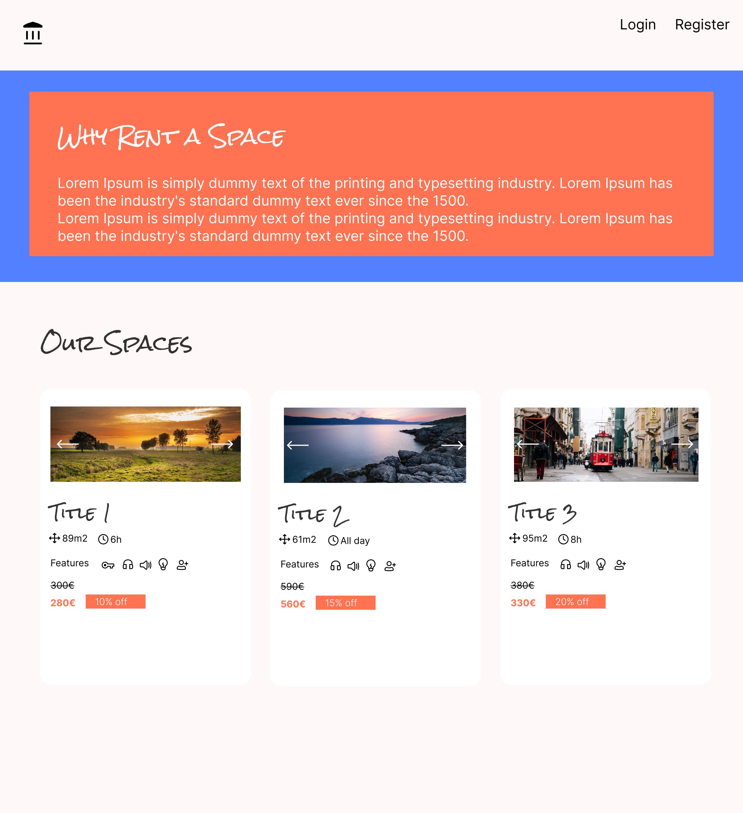
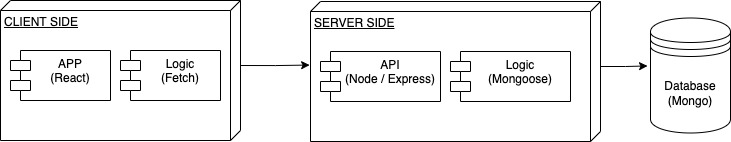
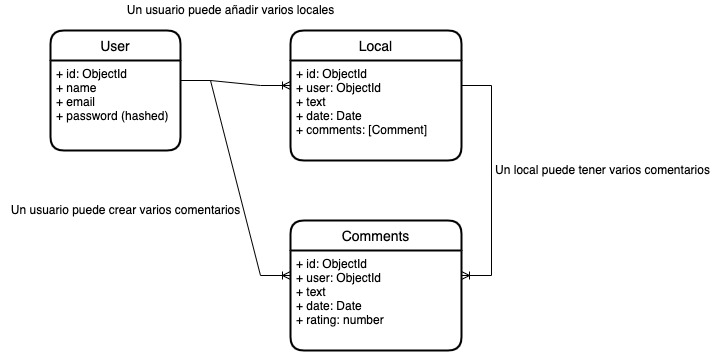

## SpaceRent

### Intro
Quieres organizar un evento pero no encuentras tu espacio adecuado ? En SpaceRent te ofrecemos la posibilidad de buscar tu espacio para esa fecha especial. Entra en la web y compara entre la multidud de ofertas de locales para celebrar tu evento. Elige el espacio que más te convenga, una fecha y reserva tu local.

- Landing page dónde se mostrarán los anuncios de forma pública
- Registro de usuarios para reservar el local

## Functional Description

Los anuncios de alquiler serán publicados solamente por el HOST. Los clientes que busquen un local para alquiler verán los anuncios de forma pública, se le pedirá registro y login para acceder a la reserva.

+ Los anuncios se verán en formato "Cards", mostrando imagen, y una breve descripción

+ Al clickar en el "card" te llevará a otro componente con el resto de información y realizar la reserva.

+ La reserva se realizará mediante un **hook de react calendar** donde se mostrará un calendario para seleccionar la fecha y hora de reserva, y el botón "realizar reserva".

Una vez realizada la reserva le llegará un mail de confirmación tanto al cliente (reserva realizada el día XX correctamente) como al HOST (Tu local XXXX ha sido reservado para el día XX a las xx:xx horas)

## Use Case

Final user

## Activities

Diagrama de actividad para el alquiler del local

## Model Cases

Las casos de uso necesarios para el funcionamiento de nuestra aplicación:

- Authenticate User: Desde el componente **authenticate**
- Register User: Desde el componente **register**
- Add Local: Desde el componente **addLocal**
- Retrieve Local: Desde el componente **retrieveLocal**
- Update Local: Desde el componente **updateLocal**
- Delete Local: Desde el componente **deleteLocal**
- Update User: Desde el componente **updateUser**
- Delete User: Desde el componente **deleteUser**

## Wireframes

## Technical Description

### Blocks

### Data Model

## Code Coverage

Soon...

## Technologies

- React 
- Node
- Express
- JWT (JsonWebToken)
- Mongoose
- Mongo

## One more thing

- Filtrar anuncios según características (rango precio, ubicación...)

- Exportar BBDD a excel