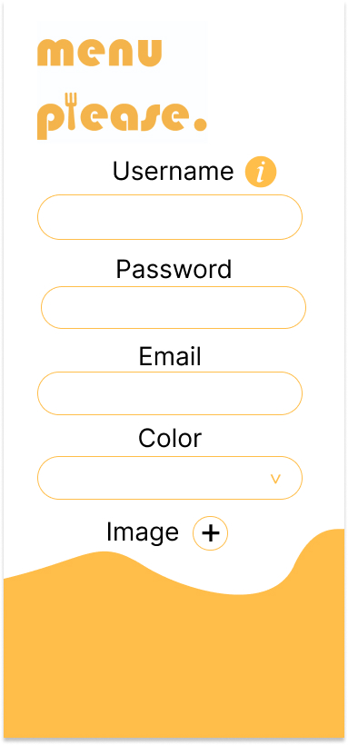

# Menu.Please

## Introduction

Menu Please it's a simple app to make menus for your restaurant. This app was thinked to be easy for all the people with o without experice in desing.

### Functional Description
Every user can use the link to see the menu like a costumer.
#### Restaurants:
- Update name and email
- Delete Account
- Create List with name, description and sections
- Create Sections with name and items
- Create Items whith name, image, categories, allergens and ingredients
- See all the List with information about sections and items
- Create a share Link to see the menu
- Use the QR code to see the mneu
- update all information about list, sections, items
- set prices for products or all menu
- can look for all the items set  ir to diferents sections or lists
- can filter in our ingredients basedata
- See especific List

### Costumer:
- See all the List with information about sections and items

### Use Cases

### Wireframes
first Sketches for the app

 

## Technical Description

### Blocks

### Techonologies used

- React  

- Node 

- Express 

- JWT 

- Mongoose 

- Mongo 

### Data model

#### restaurant

    - username
        type: String

    - email
        type: String
    
    - password
        type: String

    - color
        type: String

    - image
        type: String,

#### list

    - restaurant
        type: ObjectId

    - date
        type: Date

    - name
        type: String

    - sections: [section]

    - price
        type: Number

    - description
        type: String

#### section

    - date
        type: Date

    - name
        type: String

    - items
        type: ObjectId

#### item

    - restaurant
        type: ObjectId

    - name
        type: String

    - date
        type: Date

    - categories
        type: ObjectId

    - ingredients
        type: ObjectId

    - allergens
        type: ObjectId

    - image
        type: String

    - price
        type: Number

### allergen
    name
        type: String

### ingredient
    name
        type: String

### category
    name
        type: String

    
## TO-DO LIST
- Order system and restaurant manager
- Refactor code
- Idependent orders for costumers
- Test server side logics
    

 