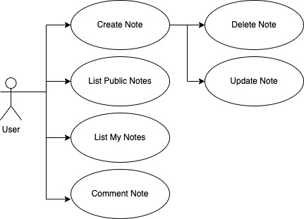
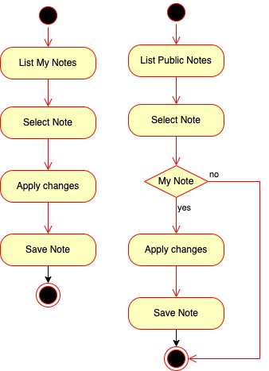
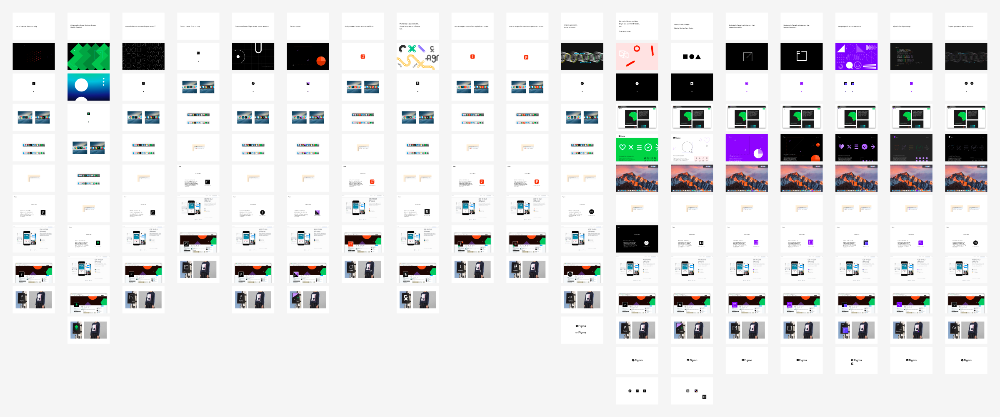
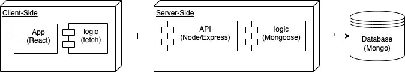
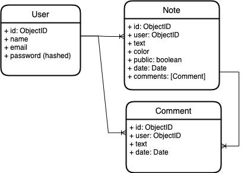

# NotApp

## Introduction

lorem ipsum...

## Functional Description

### Use Cases

### Activities

#### Edit Note

...

### Wireframes / UI Design

...

## Technical Description

### Blocks

### Data Model (ER)

### Code Coverage

### Technologies

- React 
- Node 
- Express 
- JWT 
- Mongoose 
- Mongo 

### TODO list

- Send note by e-mail
- Follow a user
- Block a user
- Send message to user
- ...