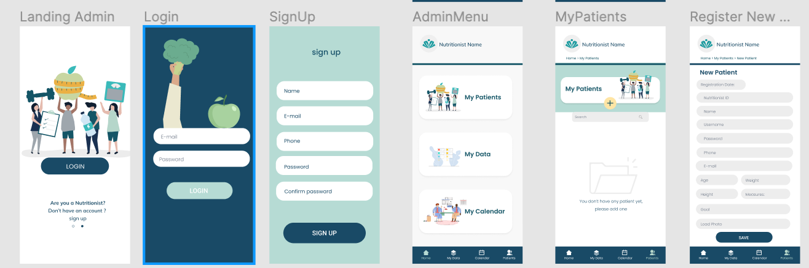
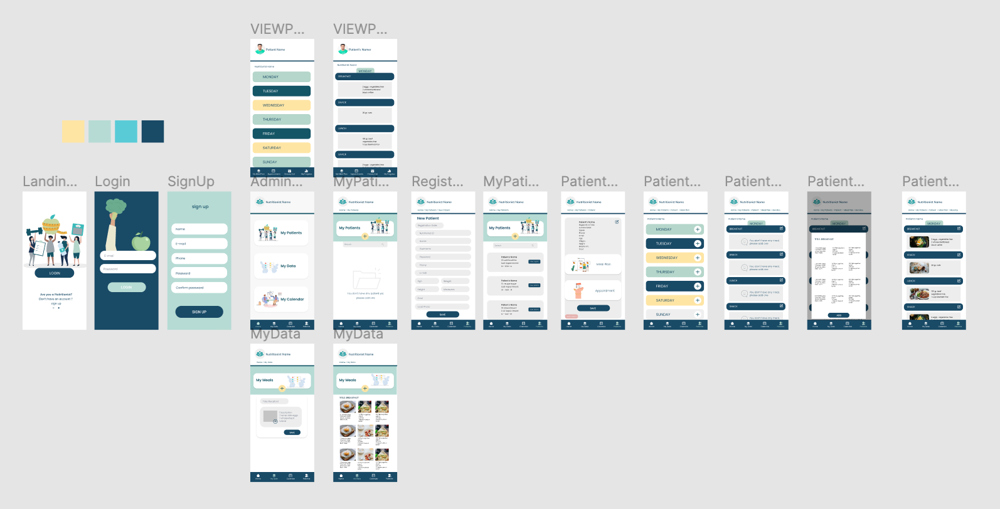

# App

# Introduction

This is an app to facilitate the management of your healthy goals.

My Meals App goal is to offer a solution to manage the Nutritionists and Patients matters. 
This app will help Nutritionists to personalize Meal Plans and share those with the patients, who will be  
able to check/view their weekly meals in here, making it easier to organize and manage. 

## Functional Description

### Use Cases

### Activities

#### Nutritionist Activities

#### User Activities

### Wireframe / UI

## Technical Description

### Blocks (app architecture)

### Data Model (ER (entity relation))

### Code Coverage

### Technologies

- React 
- Node 
- Express 
- JWT 
- Mongoose 
- Mongo 

### TODO list

FASE 2 - 3 
- Separate meals by calories blocks, in order to facilitate designing personal Meal Plans.
- Be able to schedule next appointment. (shared calendar)
- Have a progress tracker.
- Shopping List for the Patients.

