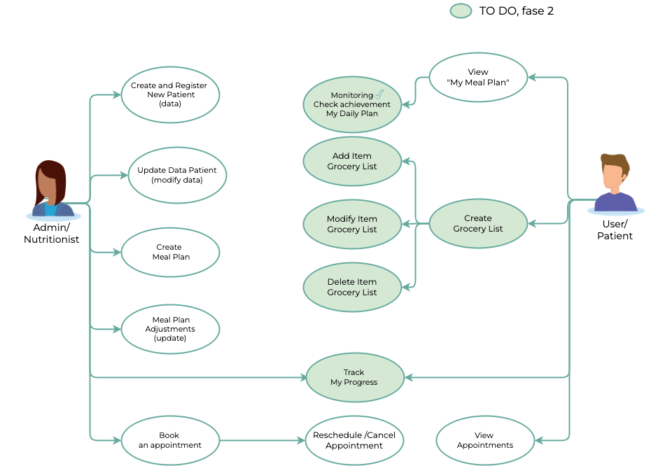
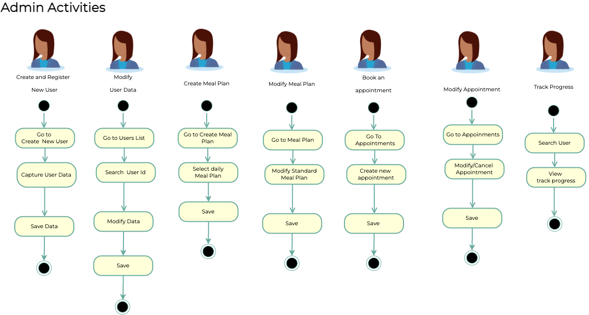

# App

# Introduction

Aplicación para facilitar llevar a cabo un plan de alimentación según objetivos.

Admin/Nutritionist:
Aplicación donde el nutriólogo  generará un plan de alimentación para su cliente/paciente, de acuerdo a los objetivos y lo compartirá con él.
Capturará datos del paciente.
Generará la próxima cita.
Modificará la dieta cada determinado tiempo.

User:
Los  pacientes/usuarios que buscan mejorar sus hábitos alimenticios y son atendidos por un Nutriólogo,  tendrán acceso a su plan de alimentación semanal por medio de la app, para así lograr y monitorear sus objetivos, tendrán acceso a modificar/ sustituir su dieta teniendo varias opciones para cada comida, según sea su gusto.
Podrán monitorear su progreso, marcando si se ha cumplido la cantidad de macronutrientes cada comida cada día.
Podrán visualizar, reagendar y eliminar la fecha en la que se tiene la próxima cita.
Podrán generar una lista de compras personales, esto para llevar una mejor organización de los alimentos que necesita para llevar a cabo la dieta.

## Functional Description

### Use Cases

### Activities

#### User Activities

#### Admin Activities

### Wireframes / UI

## Technical Description

### Blocks (app architecture)

### Data Model (ER (entity relation))

### Code Coverage

### Technologies

### TODO list