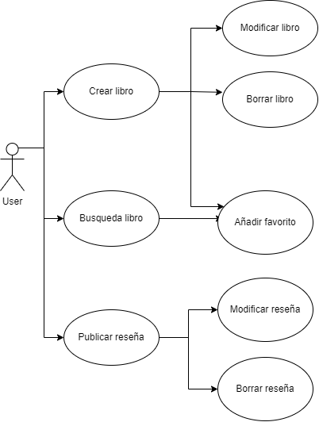
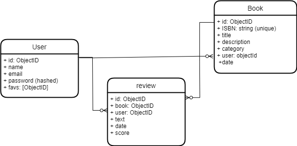

#

## Introduction
Aplicacion que permite a los usuarios compartir libros, dejar reseñas con valoraciones, tambien tienes la opcion de busqueda de libros y añadir a favoritos.
Tienes un link para poder comprar el libro tanto electronico como papel.

## Functional Description

### Use cases

### Activities

### Wireframe / UI Design

...

### Blocks

### Data Model (ER)

### Technologies

- React 
- Node 
- Express 
- JWT 
- Mongoose 
- Mongo 

### TODO list

